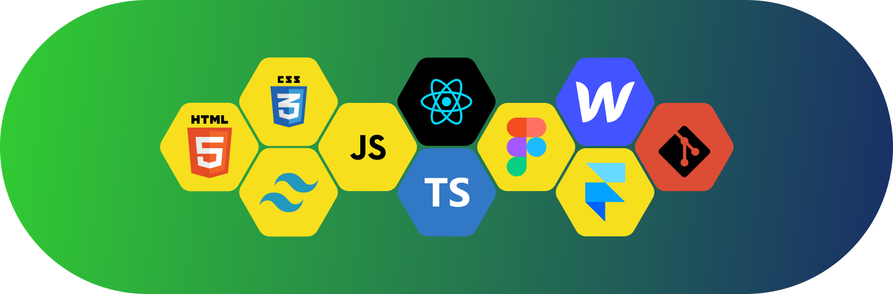

<h1>Hi! I'm Yusuf </h1>
<h2>A passionate frontend developer and UX/UI designer from Andijan Uzbekistan</h2>
<h2>🛠️ Languages and Tools</h2>

<h2>🔍 Where to find me</h2>

  
  
  
  

  

    

      
    

    

      
    

    

      
    

    

      
    

